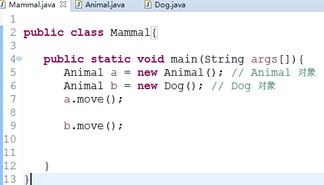
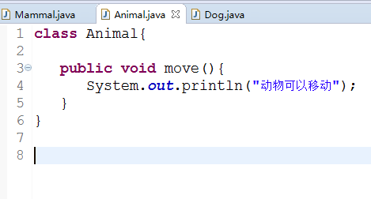
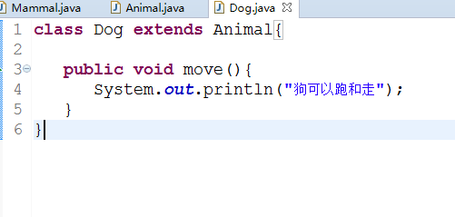
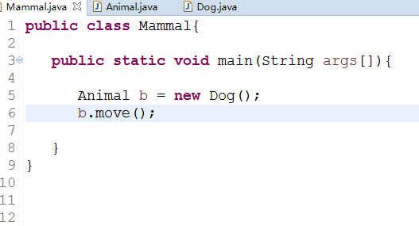
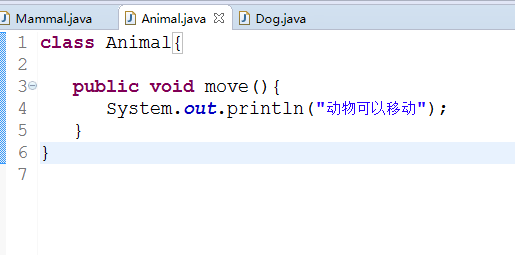
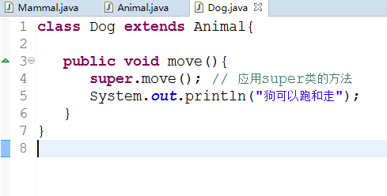

# 2016-09-21 工作日报
==============================
1.应完成目标：
    
      1. 重写
     
      2. Super关键字的使用
    
      3. 重载
 

2.已完成目标
   
   重写：
         
         
   
   
   
   
   Super关键字的使用：
                      
                           

                重载:
                public class One {
 
	public int test(){
		System.out.println("test1");
		return 1;
	}
 
	public void test(int a){
		System.out.println("test2");
	}	
 

	public String test(int a,String s){
		System.out.println("test3");
		return "returntest3";
	}	
 
	public String test(String s,int a){
		System.out.println("test4");
		return "returntest4";
	}	
 
	public static void main(String[] args){
		One o = new  One();
		System.out.println(o.test());
		o.test(1);
		System.out.println(o.test(1,"test3"));
		System.out.println(o.test("test4",1));
	}
}

遇到问题及解析：
代码运用不够熟练！
